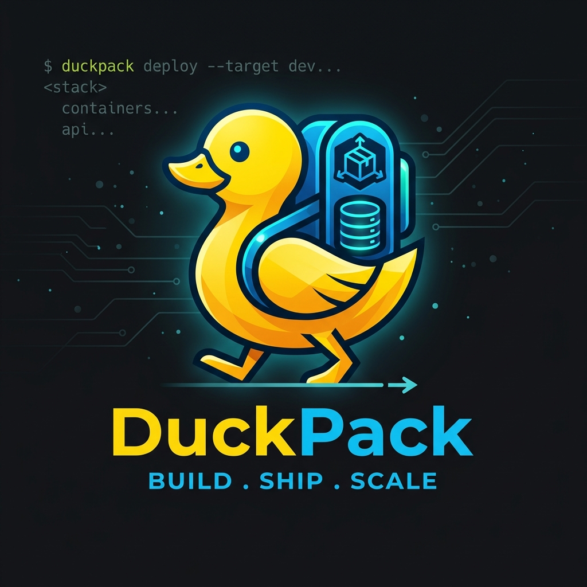

<p align="center">
  
</p>

---

DuckPack is a Rust-based CLI and Interactive TUI that completely changes how you manage DuckDB schemas. Instead of writing imperative `UP/DOWN` migration scripts, you simply write your desired database state as raw SQL files, and this engine automatically computes the diff and applies the necessary changes non-destructively.

## ✨ Features

- **Declarative Schema**: Define your tables, views, and macros as raw `.sql` files. No migration versions to track.
- **Git-Style Smart Renames**: The engine uses heuristic similarity matching. If you rename a table or column, it automatically detects the similarity (>80%) and issues a non-destructive `ALTER TABLE RENAME` instead of dropping and recreating your data.
- **Environment Variables**: Dynamically inject an unlimited number of variables (e.g. `CREATE TABLE ${ENV}_users_${REGION}`) directly into your SQL using `.env` files. The engine automatically parses them via regex and injects them seamlessly!
- **Views and Macros**: Define views and macros using standard `CREATE VIEW` statements, and the engine automatically forces `OR REPLACE` under the hood to ensure seamless non-destructive updates.
- **Interactive TUI**: Review proposed schema changes (`[NEW TABLE]`, `[DROP VIEW]`, `[RENAME TABLE]`) in a gorgeous, side-by-side interactive terminal UI before deploying.
- **Built-in IDE & Explorer**: Seamlessly explore your live DuckDB database, write queries, and save your scratchpad files directly within a powerful integrated terminal IDE.
- **DuckPacks (`.duckpack`)**: Compile your entire project into a single, immutable DuckDB snapshot artifact containing fully resolved environment variables and encapsulated pre/post deployment scripts. Deploy it instantly to production without the raw SQL files.

## 🚀 Quick Start

### 1. Installation

Download the latest pre-compiled binary for your operating system directly from the [GitHub Releases](https://github.com/yourusername/duckpack/releases/latest) page, or use the quick-install script below:

**Linux:**
```bash
curl -L https://github.com/yourusername/duckpack/releases/latest/download/duckpack-linux-amd64 -o duckpack
chmod +x duckpack
sudo mv duckpack /usr/local/bin/
```

**macOS (Intel):**
```bash
curl -L https://github.com/yourusername/duckpack/releases/latest/download/duckpack-macos-amd64 -o duckpack
chmod +x duckpack
sudo mv duckpack /usr/local/bin/
```

**macOS (Apple Silicon / M1+):**
```bash
curl -L https://github.com/yourusername/duckpack/releases/latest/download/duckpack-macos-arm64 -o duckpack
chmod +x duckpack
sudo mv duckpack /usr/local/bin/
```

**Windows:**
Download `duckpack-windows-amd64.exe` from the Releases page and add it to your system PATH.

*No Rust installation is required!*

### 2. Initialize a Project

Initialize a new declarative project directory:
```bash
duckpack init --project-dir my_project
```
This automatically scaffolds the necessary directories (`tables/`, `views/`, `macros/`, `scripts/`) and configuration files.

### 3. Define Your Schema

Write your desired state into standard `.sql` files:

**`my_project/tables/users.sql`**
```sql
CREATE TABLE users (
    id INT PRIMARY KEY,
    name VARCHAR,
    created_at TIMESTAMP
);
```

### 4. Review and Deploy

Apply your schema to a target DuckDB database. This will open the interactive TUI so you can review the proposed execution plan:
```bash
duckpack apply --project-dir my_project --db local.duckdb
```

## 🧑‍💻 DuckPack IDE / Explorer Mode

DuckPack ships with a fully integrated terminal IDE! After deploying your schema, you often want to explore the live database to verify that the changes applied correctly.

Instead of switching to a different terminal window or dealing with DuckDB file locks, you can jump straight into the IDE in two ways:
1. **Standalone:** Run `duckpack explore -p my_project -d local.duckdb` to open the IDE directly.
2. **Seamless Transition:** After running `duckpack apply`, simply press `e` (Explore) from the TUI!

### Features
1. **Integrated Query Editor:** Write multi-line SQL queries directly in the application with a built-in text editor featuring **Syntax Highlighting** (bold cyan keywords) and **Intelligent Autocomplete**. Press `Ctrl+Space` to dynamically cycle through matches from your database schema (tables, views, and columns)!
2. **Multi-Tab Editor System & Independent Results:** Manage multiple queries simultaneously! Each tab maintains its very own independent state for query results, scrolling, and column headers! Hit `Ctrl+T` to open a new tab, `Ctrl+W` to close it, and navigate between them using `Ctrl+N` / `Ctrl+P`.
3. **Full Mouse Support:** The entire IDE is highly interactive. You can instantly switch context by clicking on the Tab headers directly. The action bar at the bottom also provides intuitive `[+ New]` and `[❌ Close]` buttons you can click with your mouse!
4. **Instant Transitions:** Hitting `e` from the `apply` screen instantly transfers your locked DuckDB connection over to the IDE, allowing you to seamlessly begin querying your tables without restarting.
5. **Interactive & Expandable Explorer:** The left-hand sidebar acts as your navigation hub. You can click on any Table or View (or press `Enter`) to expand it hierarchically and dynamically query DuckDB for all nested columns and their exact data types! Click on any saved `.sql` file to load it instantly into your active tab.
6. **Execution & Isolate Queries:** Hit `Ctrl+E` to execute your query! The dynamic engine parses the typed DuckDB rows and presents your results instantly in a formatted grid. You can navigate large datasets freely using `Up`/`Down`/`PgUp`/`PgDn` and scroll horizontally using `Left`/`Right`. **To isolate a query:** Highlight text using **`Shift` + Arrow Keys** and press `Ctrl+E` to execute *only* the highlighted snippet!
7. **Real-time Syntax Error Detection:** If DuckDB throws a syntax parsing error during execution, the engine intercepts the stack trace, extracts the exact offending token, and injects a dynamic regex highlight patch—turning that specific broken word bright red and halting execution until it is fixed!
8. **Auto-Formatting:** Hit `Ctrl+F` to instantly pass your raw query through the internal `sqlformat` parser and auto-indent your code beautifully.
9. **Auto-Save:** Hit `Ctrl+S` to instantly save your active editor contents to a scratchpad `.sql` file in your `queries/` directory.

## 📦 Building DuckPacks for CI/CD

For remote deployments (like production servers running Quack/DuckDB), executing migrations over a live network connection is risky and slow. Instead, you can compile your project into an immutable `.duckpack`:

```bash
duckpack compile --project-dir my_project --out release_v1.duckpack
```

This resolves all environment variables and encapsulates your schema. 

### How DuckPacks Work (And Why They Are Non-Destructive)

You might be wondering: *"If I compile my entire project into an artifact and apply it to production, won't it just destructively replace my live database?"*

**No!** A `.duckpack` is actually an offline, empty DuckDB database file containing your fully resolved `CREATE` statements. It perfectly represents your **Desired State**. 

When you run `apply` against your production server using a DuckPack, the engine:
1. Opens the `.duckpack` (Desired State).
2. Opens your live `prod.duckdb` (Current State).
3. **Calculates the Diff:** It dynamically compares the schemas of the two databases in-memory.
4. It then applies *only* the delta non-destructively. If you added a column, it issues an `ALTER TABLE ADD COLUMN`. If you renamed a table, the Git-style similarity engine issues an `ALTER TABLE RENAME TO`. Your live data is never wiped out.

### The "Companion Install" Deployment Pattern

Because DuckDB is an embedded database without a traditional client-server protocol, the safest way to deploy changes is to run them locally on the server's disk.

By installing this `duckpack` CLI on your remote server as a companion tool, your CI/CD pipeline becomes incredibly powerful:

1. **GitHub Actions** compiles your offline SQL files into a `release_v1.duckpack`.
2. The pipeline securely transfers the `.duckpack` to your remote server via SCP/SSH.
3. The pipeline executes the companion CLI remotely via SSH to deploy the artifact:
   ```bash
   ssh user@production-server "duckpack apply --project-dir /tmp/release_v1.duckpack --db /var/lib/duckdb/prod.duckdb --auto-approve"
   ```

*(Note: The `--auto-approve` flag ensures the CLI bypasses the interactive TUI and runs entirely headless.)*

This architecture completely eliminates network latency during deployment, prevents file-locking issues, and gives you a fully automated, Git-backed declarative pipeline for your embedded database!

## 🚀 Native Remote Deploy (No CI/CD Needed!)

If you want to deploy directly to a local server or VM without setting up GitHub Actions or a CI/CD pipeline, you can use the native `deploy` command!

```bash
duckpack deploy --project-dir my_project --remote user@10.0.0.5 -P 2222 --db /var/lib/duckdb/prod.duckdb
```

This command automatically handles the entire "Companion Install" pipeline for you:
1. It locally compiles your project into a temporary DuckPack.
2. It uses your system's built-in `scp` to securely transfer the DuckPack to the remote server.
3. It uses your system's built-in `ssh` to execute the remote companion CLI and apply the changes headless.
4. It safely cleans up the temporary files from both machines!

## 📂 Folder Structure
When you run `init`, the following structure is created:
- `tables/`: Place your `CREATE TABLE` definitions here.
- `views/`: Place your `CREATE VIEW` definitions here (engine auto-forces `OR REPLACE`).
- `macros/`: Place your `CREATE MACRO` definitions here.
- `queries/`: Save your ad-hoc `.sql` queries and scratchpad files here. These are ignored during deployment and are exclusively available within the IDE.
- `scripts/pre-deploy/`: Raw SQL scripts that run *before* any schema diffs are applied.
- `scripts/post-deploy/`: Raw SQL scripts that run *after* schema diffs are applied.
- `.env`: Define environment variables for `${VAR}` interpolation in your SQL.
- `.duckdbignore`: Specify tables or views to ignore during diffing (wildcards supported).

## 🛠️ Built With
- **[Rust](https://www.rust-lang.org/)**
- **[DuckDB](https://duckdb.org/)**
- **[Ratatui](https://ratatui.rs/)** (For the interactive UI)

## 🦆 Quack Integration & Limitations

You can securely explore and apply your declarative schema directly to a remote Quack DuckDB instance! We have fully integrated native Quack database discovery. 

You can connect seamlessly by supplying your Quack token via the `--quack-token` flag (or the `DUCKDB_QUACK_TOKEN` environment variable):
```bash
duckpack apply --project-dir my_project --db quack:localhost:9494 --quack-token super_secret
```

### ⚠️ Known Quack Limitation: `ALTER TABLE`
Quack is currently an experimental extension and **does not yet support `ALTER TABLE` statements**. Because `duckpack` relies on non-destructive `ALTER TABLE` commands to safely apply schema diffs (adding columns, renaming tables, etc.), schema modifications over a live Quack connection will fail with a `Not implemented` error.

For production and remote deployments where schema modifications are required, we highly recommend bypassing Quack's execution engine entirely and using the **Native Remote Deploy** (`duckpack deploy`) command. This uses standard SSH to ship your schema and execute the migration locally on the remote server's disk, granting you 100% full DuckDB functionality.
